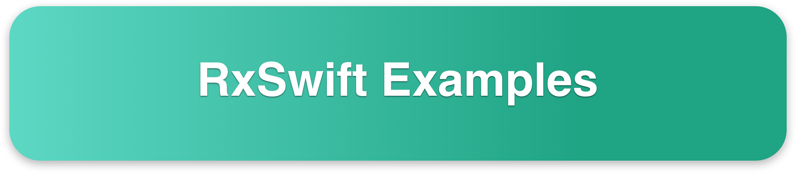

### 📜
- [x] 添加简单注册登录绑定事件实例；
- [x] 数据列表网络请求、刷新。


### 截图


### Example

`Controller` 的实现：

```swift
class JobController: BaseTableController {

    let viewModel = JobViewModel()
    
    override func viewDidLoad() {
        super.viewDidLoad()

        title = "Job"

        tableView.registerCell(nib: JobCell.self)
        tableView.rowHeight = UITableView.automaticDimension
        tableView.estimatedRowHeight = 150

        bindViewModel()
    }

    func bindViewModel() {

        viewModel.loading.asObservable().bind(to: isLoading).disposed(by: rx.disposeBag)
        viewModel.headerLoading.asObservable().bind(to: isHeaderLoading).disposed(by: rx.disposeBag)
        viewModel.footerLoading.asObservable().bind(to: isFooterLoading).disposed(by: rx.disposeBag)
        viewModel.parseError.map{ $0.message ?? "No Data" }.bind(to: emptyDataSetDescription).disposed(by: rx.disposeBag)

        let input = JobViewModel.Input(headerRefresh: headerRefreshTrigger, footerRefresh: footerRefreshTrigger)

        let output = viewModel.transform(input: input)

        emptyDataSetButtonTap.subscribe(onNext: { () in
            self.headerRefreshTrigger.onNext(())
        }).disposed(by: rx.disposeBag)

        output.items.bind(to: tableView.rx.items(cellIdentifier: JobCell.nameOfClass,
                                                 cellType: JobCell.self)) { (_, element, cell) in
                                                    cell.item = element
            }.disposed(by: rx.disposeBag)

        tableView.rx.modelSelected(JobItem.self).subscribe(onNext: { item in
            SVProgressHUD.showInfo(withStatus: item.publisher ?? "")
        }).disposed(by: rx.disposeBag)

        // load data
        tableView.headRefreshControl.beginRefreshing()
    }
}
```


`ViewModel` 的实现：

```swift

class JobViewModel: BaseViewModel {

}

extension JobViewModel: ViewModelType {

    struct Input {
        let headerRefresh: Observable<Void>
        let footerRefresh: Observable<Void>
    }
    
    struct Output {
        let items = BehaviorRelay<[JobItem]>(value: [])
    }
    
    func transform(input: JobViewModel.Input) -> JobViewModel.Output {
        let output = Output()

        input.headerRefresh.flatMapLatest { _ -> Observable<[JobItem]> in
            self.page = 1
            return self.requestJobs()
                .trackActivity(self.headerLoading)
                .catchErrorJustComplete()
            }.bind(to: output.items).disposed(by: rx.disposeBag)

        input.footerRefresh.flatMapLatest { _ -> Observable<[JobItem]> in
            self.page += 1
            return self.requestJobs().trackActivity(self.footerLoading)
            }.subscribe(onNext: { items in
                output.items.accept(output.items.value + items)
            }).disposed(by: rx.disposeBag)
        
        return output
    }
}


extension JobViewModel {

    func requestJobs() -> Observable<[JobItem]> {
        return jobProvider.requestData(.jobs(page: page))
            .mapObjects(JobItem.self)
            .trackError(error)
            .trackActivity(loading)
    }

}
```

大致用到了以下框架：

```swift
  pod 'Moya/RxSwift'
  pod 'RxSwift'
  pod 'RxCocoa'
  pod 'NSObject+Rx' # 
  pod 'RxDataSources'  # https://github.com/RxSwiftCommunity/RxDataSources
  pod 'Moya-ObjectMapper' # https://github.com/bmoliveira/Moya-ObjectMapper
  pod 'Validator', git: 'https://github.com/adamwaite/Validator.git' # 表单验证
  pod 'Hero'  # https://github.com/HeroTransitions/Hero
  pod 'DZNEmptyDataSet', '~> 1.8.1'  # 空态 https://github.com/dzenbot/DZNEmptyDataSet
  pod 'KafkaRefresh', '~> 1.4.7' # 刷新框架 https://github.com/OpenFeyn/KafkaRefresh
  pod 'ViewAnimator', '~> 2.5.1' # 动画库 https://github.com/marcosgriselli/ViewAnimator
  pod 'SwifterSwift', '~> 5.0.0' # 类似 YYKit https://github.com/SwifterSwift/SwifterSwift

```

如果有更好的建议或写法，期待能够分享。

